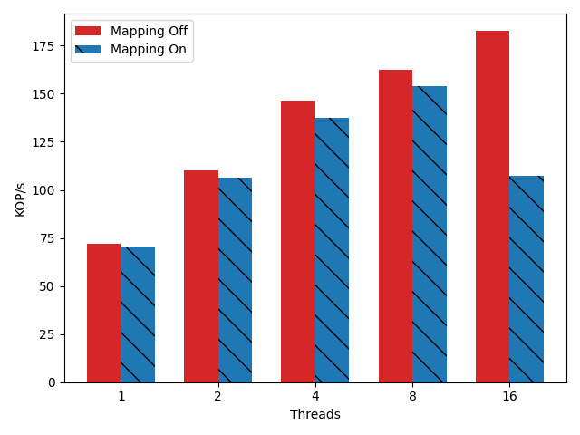
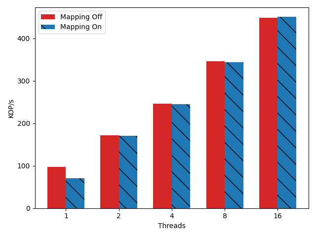
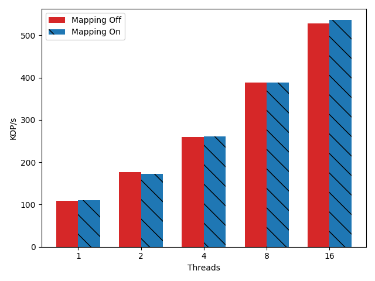
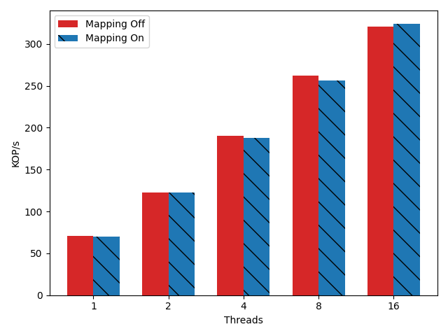
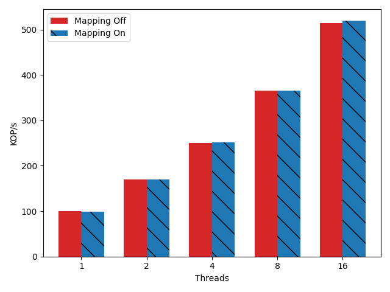

# Description

These experiments are the initial runs of the queue pair multiplexing algorithm.

## Algorithmic setup.

In their original state a queue pair is a connection between a sender and a
receiver. The pair have a direction. Sequence numbers, and message sequence
numbers are state which is maintained per queue pair to ensure ordering. We made
the observation that cross QP locking is an expensive operation. This was noted
in a bunch of literature but we decided to test it as well.

My algorithm inspects application state and uses it to detected connections.
Specifically here I'm looking at the size of the packets on writes (1084) for a
1000 byte payload, and similar for read requests. Based on these identifiers
corresponding clover CNS operations can be detected along with ACKS, Atomic
ACKS,  and read responses.

I identify the connections and keep a database of the client to server queue
pairs, and also the server to client queue pairs. Not that to learn the server
to client queue pair I first need to observe the client to server packet. I keep
a set of out outstanding packets during the initialization stage. When a packet
is sent I save the sequence number. When I see return packets I look to see what
the sequence number is. If there are no sequence numbers in the DB that match
the response, I know that it corresponds to a request that I wanted to capture.
At that point the QP mapping is made.

Once I have the QP's set for each client and server i FLIP THE SWITCH, to
mapping mode. This part is tricky as there might still be in flight messages.
For the first little bit after I flip the switch I continue to update the
original connection state using pre mapping packets as they return to clients.
It's very important there that I do not try to map them back.

## mapping algorithm

I perform mapping based on keys. All keys land deterministically on a QP based
on their value. My initial algorithm maps keys to qp using modulo. With two
clients key 1 -> qp 1, key 2 -> qp 2, key 3 -> qp  1, key 4 -> qp 2, ect. In my
experiments here I only map writes to QP. Reads are allowed to flow freely to
their original QP. The reason for this is that I don't know where the reads are
going to land at first. I need to identify them somehow in the future. This
means that reads hit less mechanism because I largely let them flow through.
However I still need to track their QP. 

When the writes or reads arrive at the switch I first identify if their QP is
part of the qp mapping set. If not they are allowed to flow through, this allows
all kinds of other traffic to be present on the switch. 

I use a connection state object to act as a proxy between clients and their
servers. The connection state in effect becomes the new client. It maintains the
sequence number that should be sent to the server. When a client request arrives
the mapper runs, and produces a destination qp. Using that I generate a request
placeholder that I place in an outstanding slot. Each connection state has a
large buffer of outstanding slots. The slot keeps the original sequence number,
the qp that the request was mapped to, the message sequence number that the
return request response should have, and some other tracking info. When the
response returns, I search though the slots to find the correct outstanding
request. The packet has it's sequence number replaced, it's message sequence
replaced, and is then sent out the door.

Sometimes packets go missing, or are not acked. This leads to some slots
remaining full when they should be empty. I garbage collect them once they are
full under the assumption that there should only ever be CLIENTS * 2 messages in
flight at any given time.

## experiments

In the initial experiments I just test the basic mapping algorithm across a bunch
of workloads. I use the ycsb benchmark A,B,C (50,5,0 percent writes), on two key
distributions Uniform and ZIPF 0.75. In each experiment 1024 keys are used,
there is a single client and a single server machine with the dpdk packet switch
in the middle. A 100Gbps melanox switch has openflow rules installed to route
the clover packets to the software switch without incurring too much overhead.

In the initial results there is a bit of a performance hit over the default no
mapping, but not by a large margin. In fact it has me worried that some of the
experiments may have gone awry despite the fact that I've double checked that
the code paths are running. It requires a bit more investigation on my part,
perhaps the true values will present themselves at higher throughput.

### Uniform A

### Uniform B

### Uniform C

### Zipf A

### Zipf B

### Zipf C

## Results

The results with the exception of uniform A are entirely unsurprising. In each
case there does not seem to be enough pressure on the QP's to actually see
serious performance problems. In the case of Uniform A it seems that at 32
threads there is a lot of work in terms of lookup to determine how to perform
the mapping.

## Considerations

In the future, I should consider putting more pressure on the queue pairs. This
basic mapping and current throughput is clearly not enough to stress the NIC. I
think that finding a more efficient algorithm might also help to show the
results more clearly.

