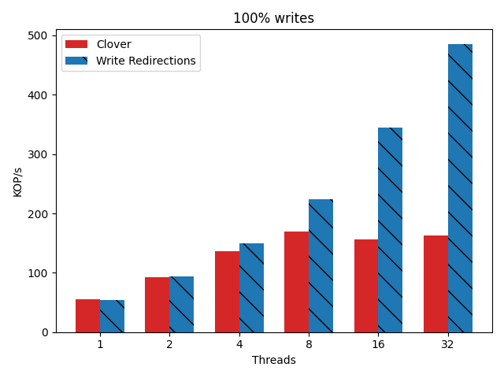

# Short Description

I created a write only workload to test the effect of write redirections in the absence of reads. The new workload is called YCSB-W. The W stands for write only. This set of experiments has all of the queue pair mapping functionality turned off. It is testing using almost exactly the same set up as was used in the WORDS deadline. The only difference is the write only workload.

## Experiment

See the words paper for a full description. Here I'm just performing writes on a selection of thread counts. There are only 3 machines at play. A single client machine makes all of the requests so the total number of threads is maxed at 32.

This experiment has
 - 1024 keys
 - 1 -> 32 client threads
 - YCSB-W workload (100% writes)
 - write redirection on (treatment) vs off (control)

## Results

The results here are very good. We get almost a 3x performance boost for the
write only workload. This was a predicted result a long time ago, but it's clear
now that we actually came through on it.

