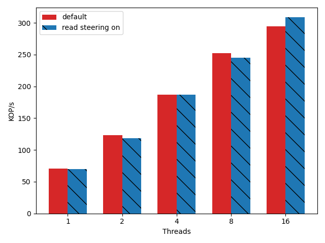
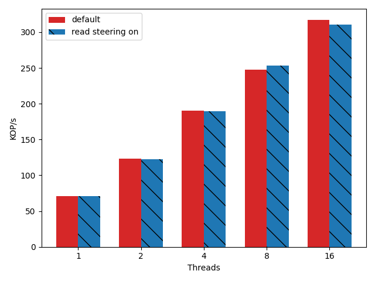
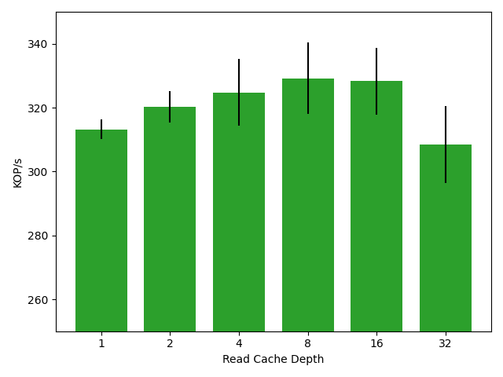
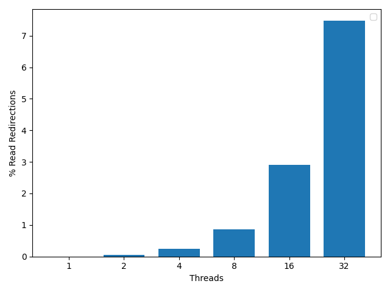

# Short Description

Reads are redirected along with writes so that there is no pointer chasing. This
comes at the cost of additional memory and computation on the switch.

## mechanism

It is more difficult to identify the clover key of reads than writes. In the
case of writes the value of the key is in the packet. It is absent on reads,
only the RDMA virtual address can be used to identify the location the read is
going to. To steer a read, the values of many old writes must be cached so that
the key which out of date reads correlate to can be identified.

## Experiments

There are 3 parameters here which can effect performance. 
 - The number of key which are cached on the switch
 - The depth of the reads which are cached
 - The number of clients which request the keys

## Experiment 0 - Basic Cached Key - one key

In the first experiment I just want to make sure that the value are sane. To
test this I'm going to set the number of cached keys on the switch to 1, and the
depth of the cache to 1. This should basically just execute the code path for
the read caching. Each experiment is run with 1024 total keys, and YCSB A
(50/50) zipf 0.70. 

The control in this experiment is just to see what happens when I turn read
caching on and off on a single key across a bunch of clients. Given that the
size of the write cache is 1. There should only be redundant updates. Meaning
that turning off the steering should speed up the program.

In this experiment I'm also restricting the number of write redirection because
these seem to be similar to me. I think that a more precise experiment would be
to measure the difference between just redirecting writes, and also adding some
number of read redirection in.

There is a small amount of variance here, I think that it's just due to noise.

## Experiment 1 - Basic Cached Key 8 keys cached

This experiment is meant to mimic that which was found in the WORDS paper. I
want to show that using only a small amount of memory we can get a bit of a
boost. In this case I'm setting the number of keys which are cached on the
switch to 8 and running through the number of clients 1 - 16.

### Hypothesis

My thought here is that this should only slow performance down a little bit. The
reason being that we will never make an update as the size of the cache is still
1, but the number of searches per read are 8. In order to increase the
performance here I will need to actually increase the size of th cache. The
performance should be a little bit higher because the reads will see a boost.

This experiment should act as a baseline for the next set of experiments with 8
cached keys where all that I vary is the size of the cache.

### Results

Here the results are almost identical. I think that there is a delicate mix
between the overhead of running the read caching, and the fact that most of the
reads are not out of date. Consider having a future experiment where the number
of updated reads are actually calculated.

## Experiment 2 - Key Cache Size 8 keys

In this experiment I'm going to run 5 runs at 16 threads each for each depth of
the read cache. Each run is held constant at 8 keys cached. My thought is that
many of the reads will become out of date, and that the additional depth will
improve their performance. Again without a count of the number of actual
redirects this is a tricky number to actually reason about.

 - 5 runs each
 - 16 threads
 - cache size 8 (keys cached read and write)
 - vary the depth of read cache
 - zipf 0.70
 - YCSB-A

### Results

It appears that by adding depth to the cache the performance improves. However
it also adds variance to the execution. The performance grows but not
substantially. The mean difference between the baseline and caching 16 deep is
only around 10k requests per second. This is somewhere around a 3% boost. While
not admissable it is not the same degree of improvement that we saw with the
write redirections. After 16 deep the performance starts to decrease. I think
that this is all due to the search.

### Takeaways
To understand what the potential for savings are in the absence of performance I
want to check how many opportunities for read redirections there actually are.
In order to do so I'll vary the number of clients while keeping the depth of the cache as deep as it can be and the number of keys at its max.

Considering that the performance is decreased due to the search, but clearly
increased due to the caching, it would make sense that I should improve the
access to the data structure. While I know that hashing the vadders will be
slow, it might also allow for a fast search where the current approach is
random.

## Experiment 3 - Number of Read Redirections as a function of clients

To understand what the potential for savings are in the absence of performance I
want to check how many opportunities for read redirections there actually are.
In order to do so I'll vary the number of clients while keeping the depth of the
cache as deep as it can be and the number of keys at its max. 

This experiment is going to be run ad-hoc with numbers being taken directly from
a print on the switch. It's important that I only count packets which require an
actual redirection to take place.

 - Cached Keys 1024
 - Cache Depth 16
 - Clients 1 - 32

### Results

There is a more than linear increase in the number of redirected writes as the
threads are increased. This strongly suggests that we can have significant
savings as the number of threads increases. Upwards of 32 threads we will likely
result in a significant number of retries. What is not captured by this graph is
the number of reads which fail more than once. Here the 7 percent are all first
try redirects.

