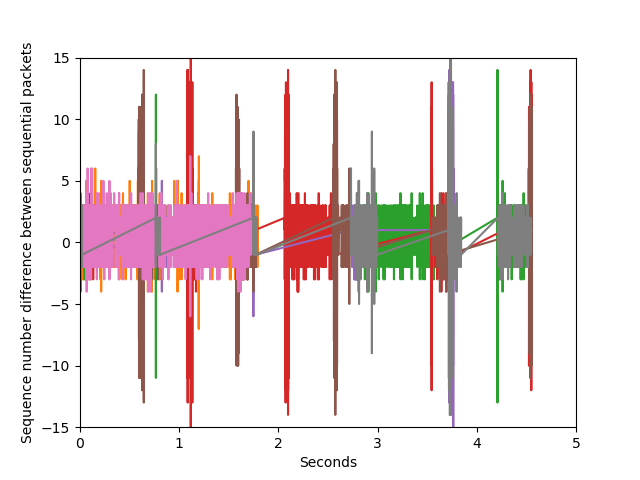
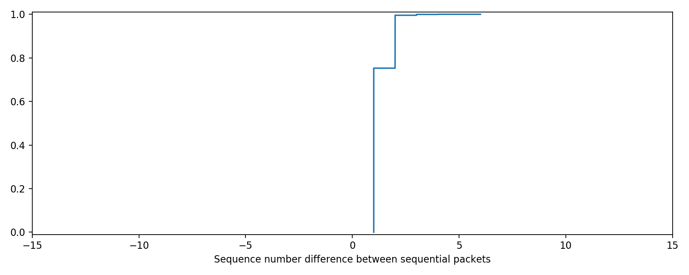
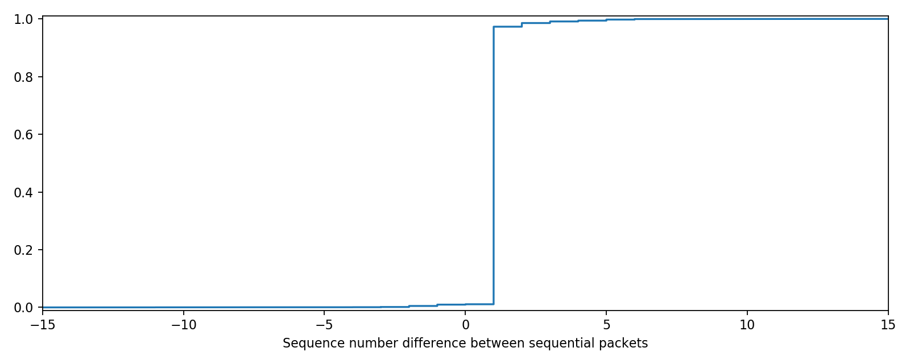
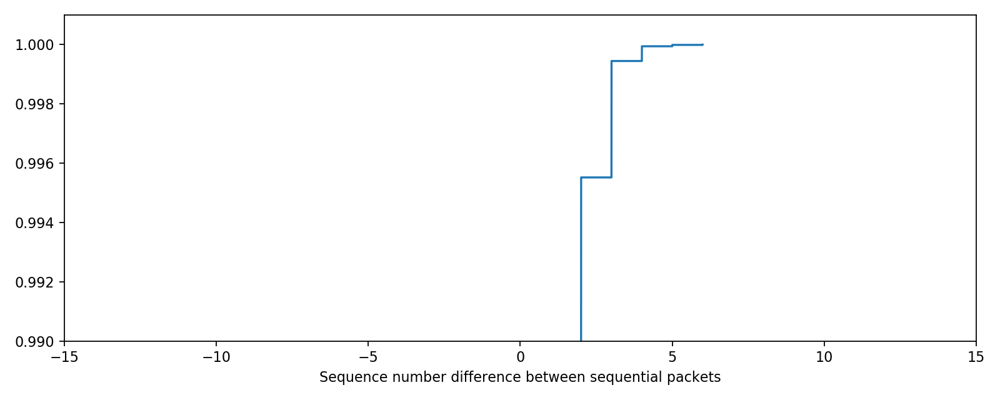
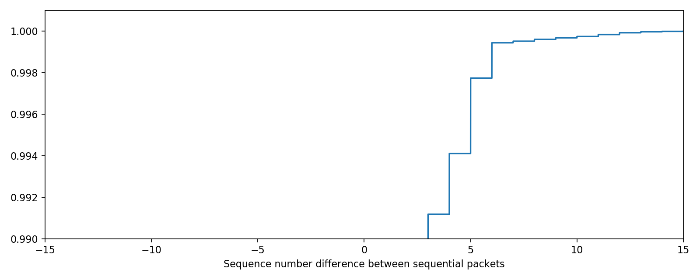

# Short Description

This experiment measure the difference in sequence number arrival order between when QP mapping is turned on vs when QP mapping is off. Results show that QP mapping on has a significant effect on the range of out of order messages, including messages arriving with prior sequence numbers.

## Experiment

The goal is to measure the order of sequence number arrives on the client when QP multiplexing is on vs off. In this setup two client machines have 4 threads each. There is a single middlebox and one server Yak-00 running both the meta and memory servers.

The switch middlebox captures the sequence number of each requests as it is
returned to the client. The sequence numbers sent are not tracked. With QP
mapping turned on the sequnce numbers are tracked in the map_qp_backwards
function after a map has been found. Without QP mapping on it's more difficulty
to know the ID. In this case I added a function to track the ID's of requests on
receive using get_id(). This breaks many other components so it can't be used
outside of this test. The measurement being taken in two spots is not ideal, but
this is a proof of concept test not a paper experiment.

The workload is YCSB-A on a Zipf distribution with a keyspace of 1024. 

")

The results of this experiment are taken from a single run each, however they were run multiple times to determine that the results were consistent across multiple runs.

## Results

### No QP mapping timeline

### With QP mapping timeline

From the timeline charts it's obvious that with QP mapping turned on sequence
numbers are arriving on a much larger spread than with the mapping turned off.
Of particular note is that some packets are arriving with sequence number less
than those that had already arrived when the mapping is turned on. These values
are negative on the chart. I believe that these are causing issues on the NICs.
With mapping turned off the range is between 1, where one is a sequential
sequence number. and 5, which is when the gap between two successive packets is
5 sequence numbers.

## No QP mapping CDF

## QP mapping CDF

The CDF of these two experiments shows the magnitude of the packets that
experience reordering. In the case with mapping on the number of packets that
have a gap of 2 almost disappears. This is a true anomaly. I'm not sure why with
mapping there is less of that kind of reordering. My guess is that it has to do
with some sort of read optimization that is taking place, but I'm not sure. 

The true killer here is that with the QP mapping on the sequence number
difference goes negative. This is triggering the go-back-n retransmissions which
is killing the runs.

## No QP mapping CDF

## QP mapping CDF

A zoom in of the 99th show how the distribution is separated. It seems that the
sequence number gaps larger than 5 occur with approximately equal probability. I
think that these are due to "reordering events" which allow for packets to go
wild for short periods of time.

## Takeaways

The first possibility is that my code is broken and that I'm serving old or bad requests as responses. If this is the case I'm doomed a bit for wasted time. The goal should be to verify that this is not a piece of buggy code, but something that occurs due to the natural concurrency introduced across QP. 

If this is a hardware problem i.e I'm triggering retransmission. Then I should
look to [melanox
OOO](https://docs.mellanox.com/display/MLNXOFEDv451010/Out-of-Order+%28OOO%29+Data+Placement+Experimental+Verbs)
as a potential fix. 

