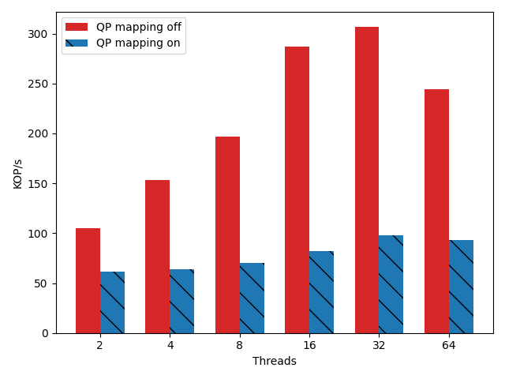

# Short Description

The baseline mechanism for QP mapping seems to be working without crashing.
However, the performance of the QP mapping is low, far far lower than will allow
for proper tests. The goal is to document the performance improvements with the
goal of hitting just over 1M or more within a few days.

## Experiment 00 Baseline

The baseline compares mapping on and off with the default unoptimized code. In
this current state I'm still using the fast modular lookup for mapped packets.
Read steering is on, and the distribution is zipf. I have not done a profile of
the code at this point. The starting goal here is to trim as much fat as
possible from the existing code.

## Takeaway 00

The code barely scales. Adding more threads does little to improve the performance of the mapped code. I think that this has little to do with my algorithms such as the QP mapping itself, and much more to do with the additional latency of hitting a lot of my code.

