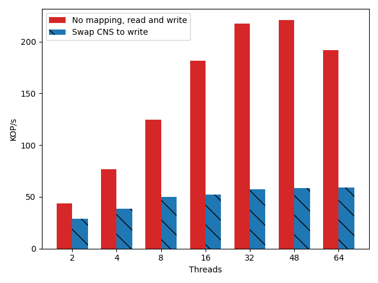
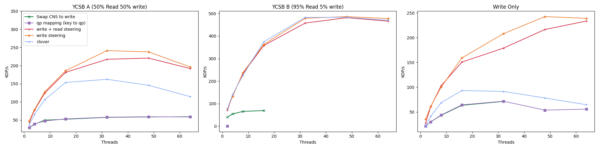

# Short Description

CNS are expensive, Ive replaced all of the CNS operation with writes, and
enforced ordering. Ideally this should have a significant performance boost.
Considering that it took me around a year I hope that this is correct. The goal
of this experiment is to test the baseline throughput of the mechanism against a
default and intermediate stages.

## Mechanism
These are single core middle box experiments with a variable number of client
threads. All of the workloads are zipf. 

The additional mechanism for CNS replacement takes each incoming CSN, and
rewrites the packet header so that it is a write. When the acks return they are
mapped to atomic acks so that the sender does not see a difference. It is
required that in order to run CNS replacement the QP mapping is turned on.

With CNS turned on so is all of the mapping functionality. That is we are doing
qp steering towards queues that serve individual keys. The mapping is round
robin. As CNS operations come in they are replaced with writes. When the write
acks come back, I swap them out with atomic ACKS. The big issue with this move
is that when packets are coalesced on the memory side I don't get some of the
acks back to the client. My algorithm now fixes that by injecting acks.

## Experiments

## Experiment 0 - CNS swapping on vs off throughput measure.

This experiment compares the performance of two prior features with the new CNS replacement features. The prior will be hereafter refered to as read + write caching. This is not default clover, it is the combination of write caching (WORDS) and the read caching mechanism. It does not include QP mapping. In contrast the CNS swap includes both the QP mapping (a nessisary precondition) and CNS swapping. 

## Experiment 1 - Hero Graph (first try)

This experiment aims to pull apart each of the different components and compare
their performance. Each piece builds and so each additional component has the
prior components added on. From baseline to the most decorated the order is:

 * Clover
 * Write Steering
 * Write + Read Sttering
 * QP mapping
 * Swap CNS to write

Up until this point all reported values have been for the first chart YCSB-A.
This is the first attempt to capture the other two workloads YCSB-B and Write
Only.

### measurement limitations

CNS to write has difficulty completing with more than 16 threads in YCSB-B.
While I was able to get some measurements the data for simple qp mapping is
missing entirely (the point at x=0 y=0 is a todo placeholder) The other missing
points were not able to complete. Each point on this chart represents the
results taken from a 10s experiment in which the throughput average was taken
from each thread.

### takeaways

The largest takeaway is that additional code adds overhead to the system. qp
mapping requires quite a bit of middlebox code, and as such it is slower in all
cases and bottlenecks the fastest. This is unfortunate as it's algorithm is the
most efficient. As we scale back to a multicore middlebox these numbers will
likely rise significantly.

In the 95% read case we do comparable to default clover in the write, and read +
write cache case. This is important because in these cases we do little to help
the algorithm so maintaining similar performance even in a bad scenario is good.

I'm not sure the cause of read + write being slower than just write in the
YCSB-A case. I would imagine that this should cause a speed boost. Prior
measurements indicated that it did, however they were taken at higher speeds. In
the write only case the same is true. My guess is that in the single core case
the small overhead of doing the read lookup on every packet is more than what is
gained from it being out of date. However this could also be a bug, which is not
routing the reads to the correct location and causing retries. I will need to
debug this to learn more.

