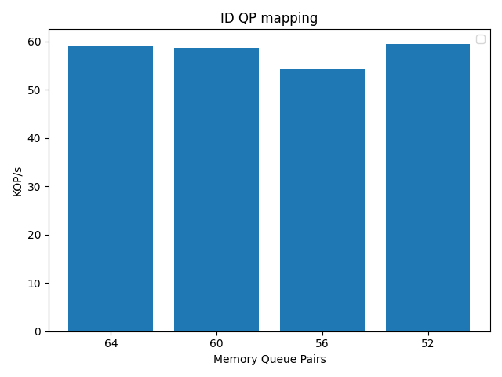
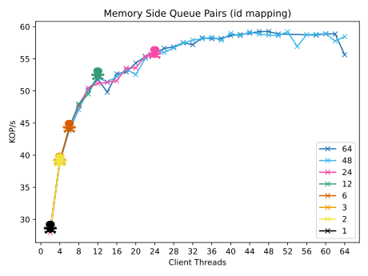
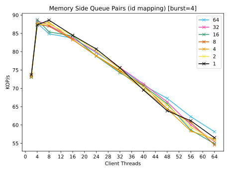

# Short Description

QP on the memory side NICs are a scarce resource, as such we should measure the
effect of using fewer of them. This experiment constricts the number of memory
QP that the clients can use to access remote memory.

## Mechanism

In prior experiments, to choose a memory side QP for the QP mapping, we take
`key % clients`. This makes use of all of the memory QP evenly. In order to have
all memory accesses be ordered we need the reads and writes for specific keys to
land on the same QP. We want to motivate the need to use more than just one. In
each measurement I run `key % num` where num is some factor of two of the full
set of QP.

## Reference

A measurement similar to this was taken in [design guidelines for high
performance RDMA
sysetems](https://www.usenix.org/system/files/conference/atc16/atc16_paper-kalia.pdf).
Their performance metric is taken on RDMA primatives which gives a pure
measurement of the performance on ConnectX-3 NICs.
. They show a sharp increase in
performance by adding an additional QP to the operations. The additive
performance bennift falls off after 2. In the case of raw IB the performance
continues to grow almost linearly (aprox 6million additional ops per second per
qp).

## Experiments

Running with 64 client threads on two machines.

## Experiment 0 - CNS swapping on vs off throughput measure.

## Experiment 1 - ID QP mapping (still incomplete)

In this second experiment I'm using a different mechanism to determine which QP
the requests land on. The mapping is done entirely by the ID. Where as before
the requests were state based, reliant on the algorithm, in this case they are
100% reliant on the QP connection. In some respects this is a more pure
measurment especially when I perform it using powers of 2.

## results

This experiment is currently incomplete, however I hypothesize that we will not
see much of a performance degradation here as the absolute value of the ops/s is
not in the range noted by prior work.

## Experiment 2 - ID QP mapping queue pair restrictions

The goal of this experiment is to determine the differences in performance when I funnel multiple threads into a subset of queue pairs. Here I have CAS turned on, there are no atomic replacements, and I'm using queue pairs as identifiers, not keys to steer requests. In each experiment I set the number of queue pairs to be static, each one is given a separate line, and I increase the load by adding client threads. An example of the mapping would be thus

4 threads, 4 qp

1 --> 1  
2 --> 2 
3 --> 3 
4 --> 4 

4 threads, 2 qp

1 --> 1 
2 --> 2 
3 --> 1 
4 --> 2 

6 threads, 4 qp

1 --> 1 
2 --> 2 
3 --> 3 
4 --> 4 
5 --> 1 
6 --> 2 

as can be seen the load per qp is a function of the number of threads, not the distribution of the workload. My experiment usually fail when I fold more than one client into a single qp. This is actually relatively new behavior after I stabilized the dequeue mechanism. The point of this experiment is to see if there are any imergent patters now that my results are consistent.

The first key takeaway is that at least at this speed, the number of qp does not
seem to have an apreciable effect on the performance. Each point is taken from a
single run, and they all seem to be within the variance of each other. I've
placed a skull where each theread dies. In most cases it's when I fold at least
2x the number of clients into it. Each skull is the last valid measurement, not
the point of failure. For instance the Green skull at 12 clients shows that the next measurement at 14 failed. 

## results

The number of qp does not seem to make a difference at low speeds, however
folding multiple clients into a single qp is often, but not always a failure
with this current setup. Note that 48 qp is sufficient for 64 threads with no
trouble, but 12 qp is not enough for 14. This is very likely to do with an error
in my code, and not a fundamental issue with the NICs.

## Experiment 3 ID QP mapping queue pair smaller burst

I think that I worked through most of the bugs, however I still have issues
preparing the desired result. One small aside is that I've made a chart for
checking the number of in flight messages, and done this on a per operation
basis. In this directory I've included the debugging charts for 4 clients going
into a single QP with the number of outstanding requests [All operations
together](4_clients_in_flight.pdf) [Separte
Operations](4_clients_in_flight_ops.pdf). I can't embed the PDF, nor recreate
these so I'll just leave them as links. This small debugging result suggested
that the implementation was correct. I decided to change the burst size to see
if that was causing an issue on the receiver side.

The setup for this experiment is almost identical as Experiment 2 with the
exception that the burst size has changed.

## results
Due to the smaller burst size the average latency of operations increase,
therefore the single threaded runs get a higher throughput than the burst size
32 experiment. Note that this time around there is a significant hit in the
performance after we go above a certain offered load.

I'm not 100% sure how to interpret these results at the moment. There is a
possibility that the reduction in performance after 4 threads is simply due to
me not being able to process requests at a sufficient rate. Essentially the drop
might be my fault. However it could also be due to the CAS running. The way to
know this is to replace them. Either way the next two experiments using the key
to qp mapping are obvious. I must test how the CAS vs atomic replacement works
at this stage.

My strong feeling at this point though is that it is my fault as I've hit
numbers higher than this with similar configurations.

