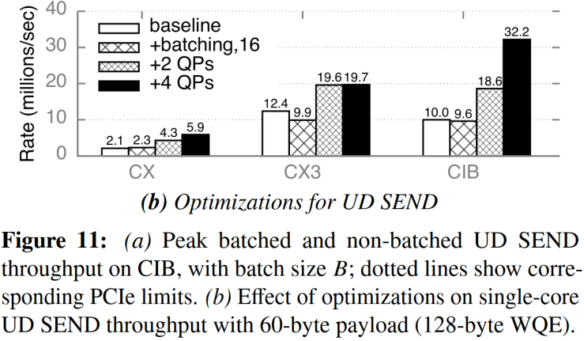
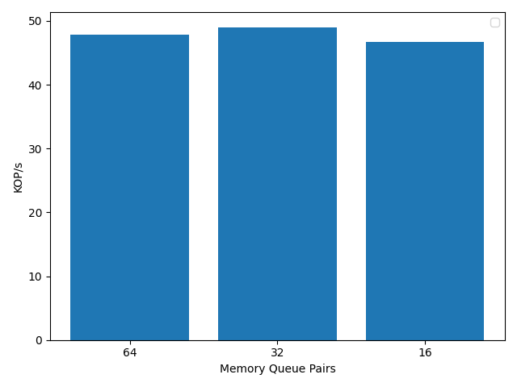

# Short Description

QP on the memory side NICs are a scarce resource, as such we should measure the
effect of using fewer of them. This experiment constricts the number of memory
QP that the clients can use to access remote memory.

## Mechanism

In prior experiments, to choose a memory side QP for the QP mapping, we take
`key % clients`. This makes use of all of the memory QP evenly. In order to have
all memory accesses be ordered we need the reads and writes for specific keys to
land on the same QP. We want to motivate the need to use more than just one. In
each measurement I run `key % num` where num is some factor of two of the full
set of QP.

## Reference

A measurement similar to this was taken in [design guidelines for high
performance RDMA
sysetems](https://www.usenix.org/system/files/conference/atc16/atc16_paper-kalia.pdf).
Their performance metric is taken on RDMA primatives which gives a pure
measurement of the performance on ConnectX-3 NICs.
. They show a sharp increase in
performance by adding an additional QP to the operations. The additive
performance bennift falls off after 2. In the case of raw IB the performance
continues to grow almost linearly (aprox 6million additional ops per second per
qp).

## Experiments

Running with 64 client threads on two machines.

## Experiment 0 - CNS swapping on vs off throughput measure.

## results

This experiment is currently incomplete, however I hypothesize that we will not
see much of a performance degradation here as the absolute value of the ops/s is
not in the range noted by prior work.