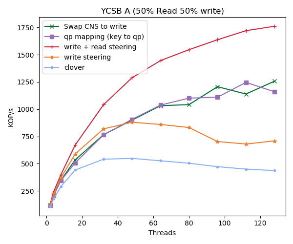

# Short Description

These experiments are being taken after an extreme amount of performance tuning
has been applied to the middlebox. Currently it is fully multithreaded, and the
only locks are for the connection state when packet sequence numbers and slots
need to be updated. In the future this too could be improved. For these tests
Clover, Read, and Write each have 12 cores which both perform RX and TX
together. In the CNS to write and Map case I have 3 cores performing RX and
doing the QP mapping, and 9 cores just TXing and doing the checksum on each of
the packets.

This benchmark is really just a step in the right direction, and not a result of
any kind. The goal at this point is to continue moving the CNS swapping
performance up.

One of the goals along the way should be to move the meta data sever to it's own
machine. In this case it is shared with the memory server. I also need to reduce
the packet size. Packets for this experiment, in terms of reads and writes are
1024. These are not the majority of packets, however they are the ones that
cause a lot of the blocking (I think)

##Experiment 1

Here I've moved the metadata server out of the way so that the middlebox can run
only on the traffic between the memory and the client. In this setup the client
is running on Yak0, the Memory is on yak 1, the middlebox is yak2 and the
metadata server is sitting on yeti-05.

The big thing in this experiment is the openflow rules which only route to and
from memory, so that the traffic from the metadata server does not get touched.

`sw100 [standalone: master] (config) # openflow add-flows 1 ip,table=0,in_port=Eth1/29,nw_src=192.168.1.12,nw_dst=192.168.1.13,actions=output=Eth1/31`
`sw100 [standalone: master] (config) # openflow add-flows 2 ip,table=0,in_port=Eth1/30,nw_src=192.168.1.13,'nw_dst=192.168.1.12,actions=output=Eth1/31`

