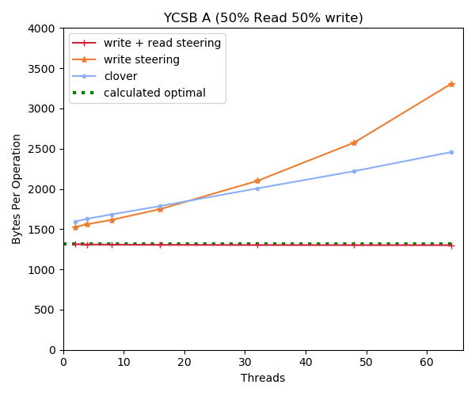
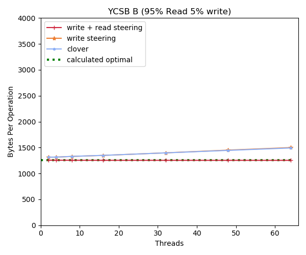
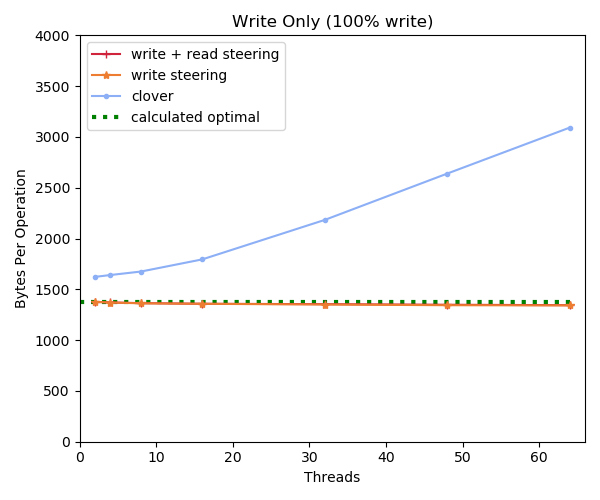
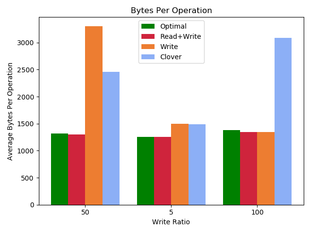

# Short Description

The goal of this experiment is to measure the reduction in bandwidth per
operation as a function of the steering algorithms. The hypothesis here is that
with read and write steering on, we should get perfect bandwidth. Write should
have a reduced bandwidth, but an improvement over clover. Clover should see an
increase in bandwidth per operation as the contention grows.

This experiment will be conducted in 3 stages for YCSB A,B, and write only. The
variable will be the number of threads which will act as a proxy for contention. 

# Summary Results

The summary of the results for the 64 thread configuration are below

