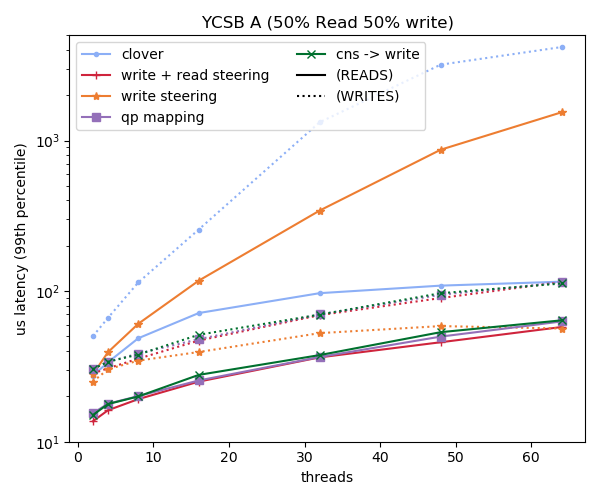
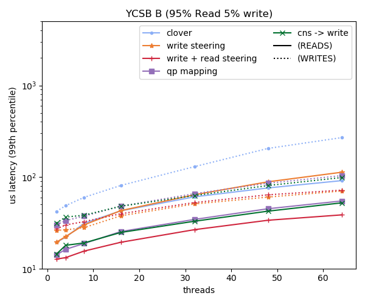
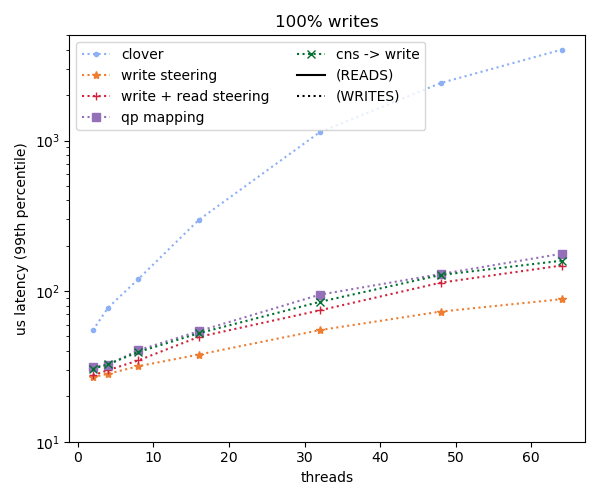
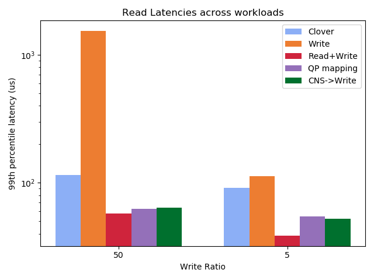
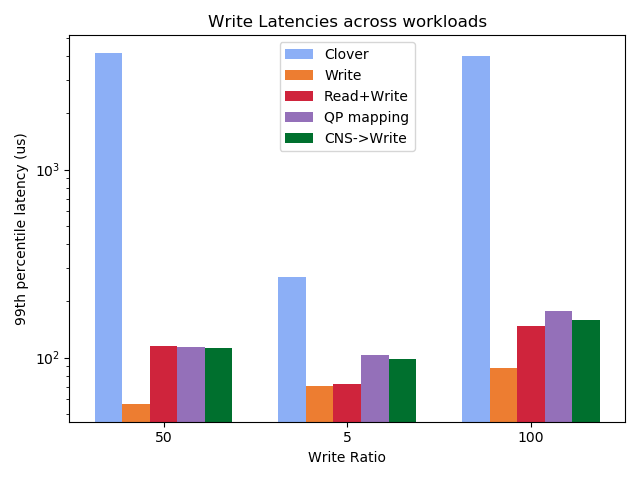
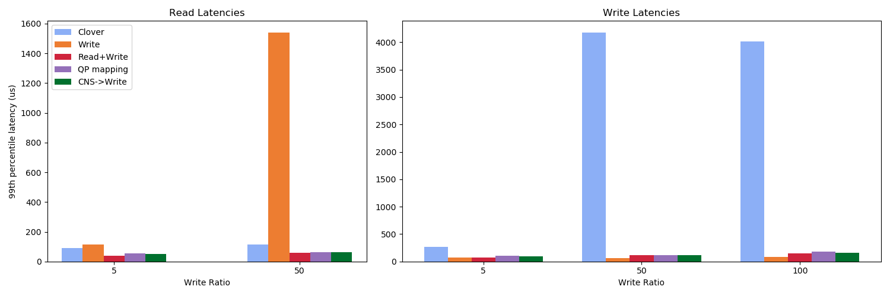

# Short Description

The goal of this experiment is to measure the tail latency improvement for each
of the packet steering techniques. 

## setup

I've insturmented Clover to timestamp before and after each request and then
write to a file with the latency. My scripts then scrape after the test and do
stats on the values. Im running with 2 clients on Yeti5 and Yeti0 memory is on
Yak0. The metadata server is on Yak1 and the middlebox is on yak2. I've set up
openflow rules to port forward the requests this way. These do not have the
overhead of the metadata requests.

# Summary Results

The summary of the results for the 64 thread configuration are below

