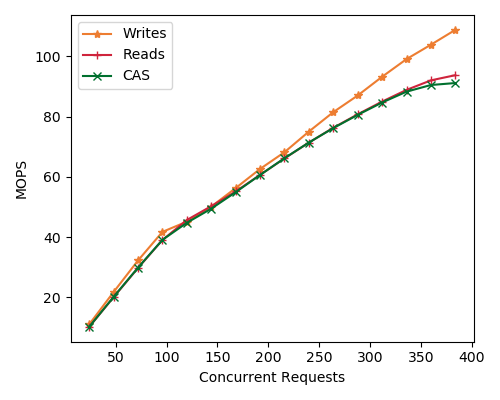
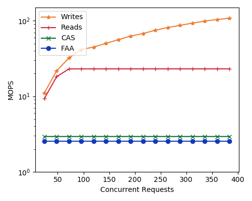
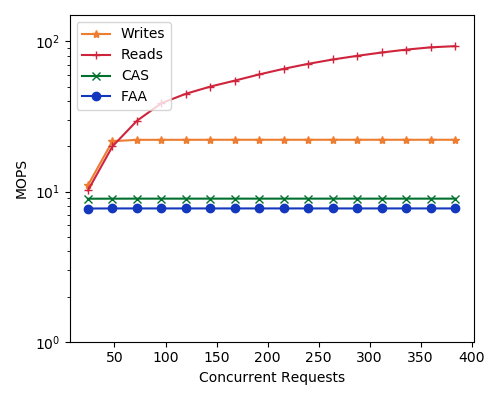

# Short Description

I found that I could map device memory directly into the space which clients
RDMA into [device
memory](https://docs.nvidia.com/networking/display/MLNXOFEDv461000/Programming).
This was relatively easy to do and I decided to take a stab at measuring the
performance boost from mapping atomics to this reigon. The first thing I did was
run my parallel RDMA benchmark on the mapped memory. The atomic at test here is
the CAS instruction. I have 24 threads, each with it's own QP. At each
measurement point, the thread has been given an additional in flight request.

Interestingly this snaps the performance of the parallel cas right up to that of
reads. This is likely the highest I've ever seen reported. I got this idea by
reading the Sherman paper SIGMOD'22 which makes a B+Tree in disaggregated memory
and uses this device mapped memory for atomics.

I was thinking about serializability as a concept and decided that it was time
to add the FAA instruction in. I think that it's the simplist instruction which
implements serializabilty.

I measured it's performance on the host, and on the device memory.  In this
experiment it's running on a single address. This makes the contention really
high for the atomics. Note that the dev mem is 3x faster than the host memory
for both atomic categories on a single key. 

