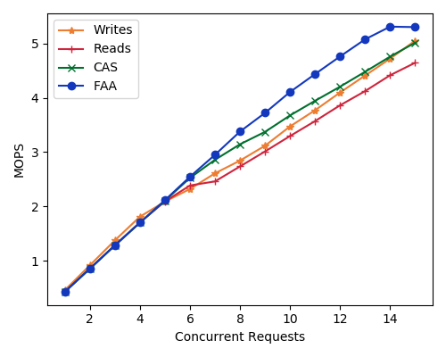

# Short Description

Cindy was nice enough to install CX6s into the Yak0 and Yak1 machines. I'm going
to benchmark them to see what the differences are between them and the CX5. My
biggest goal is to determine if there is a difference between the two
technologies with how they deal with device mapped memory. Current device mapped
memory on Cx5 is much faster than going to the host, but it still bottlenecks
faster than I would have considered normal. For instance the CAS usually
requires 2 pcie  RTT, without needing to do that it should be more than 2x
faster.

# Experiment 1

Baseline measure of the hardware. I'm starting with a single threaded
performance benchmark of each operation on a single key. The setup is the same
as prior benchmarks with the exeception that we are using CX6. The CX6's are
running at 100gbps for this experiment as the switch which interconnects them
can only run at a max of 100gbps.

The purpose of this first experiment is just to make sure that everything looks
normal on a single core. This experiment is the same as what is found in the top
left of
[019_CNS_bottleneck/key_qp_ops.pdf](../019_CNS_bottleneck/key_qp_ops.pdf) except
that I'm performing the measurement on device mapped memory.

Interestingly with the device mapped memory the atomics are actually coming out
faster than the inline writes! a hilarious turn of events when operating at this
regime.

# Experiment 2

Multiple threads on the same key. Here each thread gets a single QP. At each
step in the measurement each thread gets one additional bit of concurrency. This
is the exact same experiment run in
[024_device_mapped_memory/single_key_dev_mem.pdf](../024_device_mapped_memory/single_key_dev_mem.pdf) so I've included those values in black.

Surprisingly the values on the CX6 are a chunk lower than the values on the CX5.
I can only assume that the device is not tuned perfectly for these operations at
100gbps modulation rate and therefore runs slower. CX6 FAA runs at 5.7 MOPS and
CX5 runs at 7.7 (1.35x faster), and CX6 CAS runs at 67.0 while the CX5 runs at
89.0 (1.32x faster). I'm now very curious to know what the deal is here.

# Experiment 3

Multiple threads and multiple keys. Here each thread has an independent key. There are no collisions at all. Again I have the exact same experiment run on the CX5's from 024, and I've referenced the data over for a direct comparison (in black).

Again the trend between the two NICs is almost identical, with the exception that the CX6 performs worse than the CX5 at 100gbps. Note that I'm missing the FAA for CX5, but I have no reason to believe it would have been slower than on the CX6. One trend that is very strangely similar is the pairing of performance between reads and CAS wich also forks at around the same point in the graph, but at different absolute values.

## reference 
