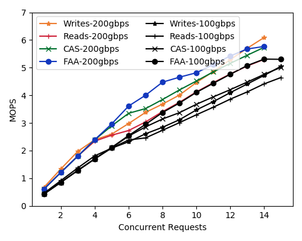
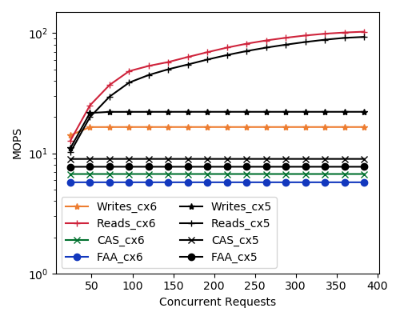
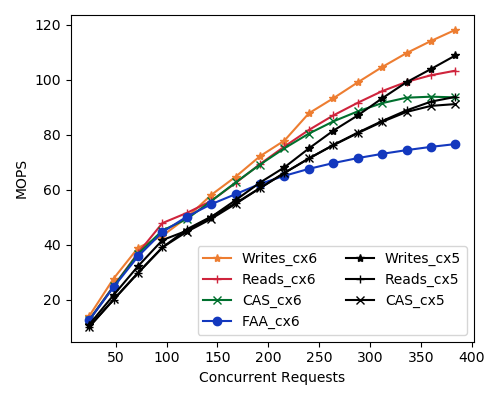
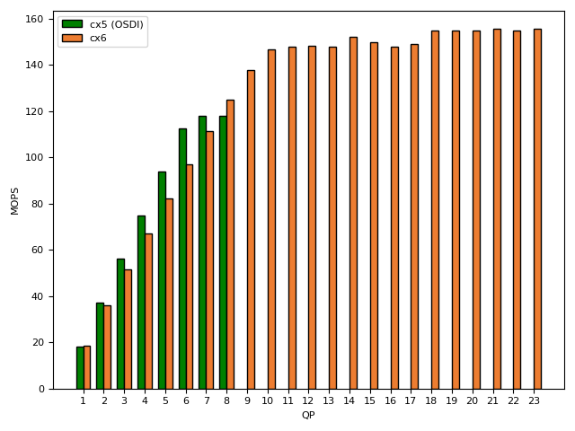

# Short Description March 20 2022

Cindy purchased and gave me a 200Gbps cable (200GBPS QSFP56). It took a few months but now it's here. I've connected the NICs directly to one another because we do not have a 200gbps switch. This will effect the overall performance of these bench marks because the RTT will be lower than if the data had to transit a switch.

I've set the modulation rate of NICs to 200Gbps and I'm going to re run the same experiments that I ran for the profiling experiment before. Additionally I'll run the QP bottleneck experiment to see how these differ between the two NICs.

# Experiment 1 Single Thread Single QP

I'm going to compare the single threaded performance for the CX6 at 100gbs and 200gbps. The 100Gbps numbers were collected with the NIC connected to a switch which will decreased the latency of each operation by two hops. Outside of this the operations are exactly the same. A single thread is given a single key and it makes iterative requests to that same key for each of the operations that I've got in Anils test suite. All operations are 8 bytes. Writes, Reads, CAS, and FAA.

We can see that each operation is a bit faster on the CX6 at 200Gbps. This is to be expected, especially when there is no interference. I might have not actually made requests to a single key. In which case these values are off and should not be reported anywhere. They are mostly intended as a sanity check. Given that the latency is lower the small performance boost seen here is reasonable. Also the modulation rate is faster so individual packets are processed with lower latency.

# Experiment 2 Multiple Threads single key

I used the same methodology as the prior experiment except that I've added multiple threads. Each thread is run simultaneously and given a degree of concurrency. The X axis is the degree of concurrency total. At each step of the experiment I give each thread, which has one QP an additional degree of concurrency.

Unfortunately nothing really seemed to change here. The values for the CX6 device mapped memory have the same lower values as the CX5 even when at a higher modulation rate. The reason for this is unclear. It might have to do with a configuration issue. At the time of writing I have not attempted to look deeply into the CX6 device configuration.

# Experiment 3

The third experiment is independent keys, and independent QP. It scales just as in experiment 2, except that we have more that 1 key. In this case I have a total of 1024 keys. Which is enough to satisfy independence for each thread. It would have been nice in this experiment to use a lot of memory and separate each key by a distance so that they do no land on the same cache line. Unfortunately there is no enough space on the NICs for me to do this effectively. If I did want to max it out I could do a little bit of math and determine exactly how much of a gap I could place between each key. This is left for later experiments if I need to attain good numbers. 

Here again the values are very close to what was found before. There is no exceptional increase in the CX6. The improvement in overall throughput is likely due to the reduced latency per operation, and the increased modulation rate. 

# Experiment 4

I decided to re-run the QP bottleneck result from the OSDI submission and compare the two. This experiment uses host memory, not device mapped memory. The ammount of concurrency is set to the max possible (372) for each QP at the start. One QP, with a new thread, is added at each step of this measurement. In the paper I stopped running the experiment after the values topped out. Here I've run it all the way out to 24 QP.

The increase in throughput is approximately the same here. There are subtle differences in performance, however no trend really presents itself. The max throughput is around 30 MOPS faster on the CX6. It does not plateau immidiatly, instead there is a small peak, followed by another one at higher QP. It's hard to draw too many conclusions from this. With a cursoy look at the PCIe 3 16x I should be able to process 8 giga transactions per second. I think that this still falls short of that. I'm not sure if we are hitting the PCIe bottleneck. It would be good to check the understanding PCIe bandwidth to see if this does actually make sense. At this point the bottleneck falls short of the 215MOPS which are advertised on the CX6 [product_page](https://www.nvidia.com/en-us/networking/ethernet/connectx-6/).

