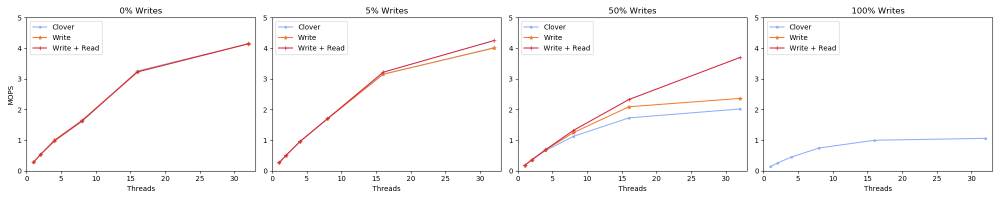

# Short Description May 23 2022

A huge amout of time has passed, I've built a version of swordbox for a p4 swtich. These results are the first cut at actually getting paper ready plots. Big changes include actually being able to run on smaller packet sizes

# Experiment 1 1024 packets

I'm running at 40G with a single client that has 40 cores, and I've set the packet size equal to 1024. Note from this experiment that at around 4mil ops/s we start to actually hit the bandwidth limiation of 40Gbps.

I was able to reduce the packet size using some clover hackery. Below are the results with the core count blown way out to use both NUMA domains on Yeti-05.

