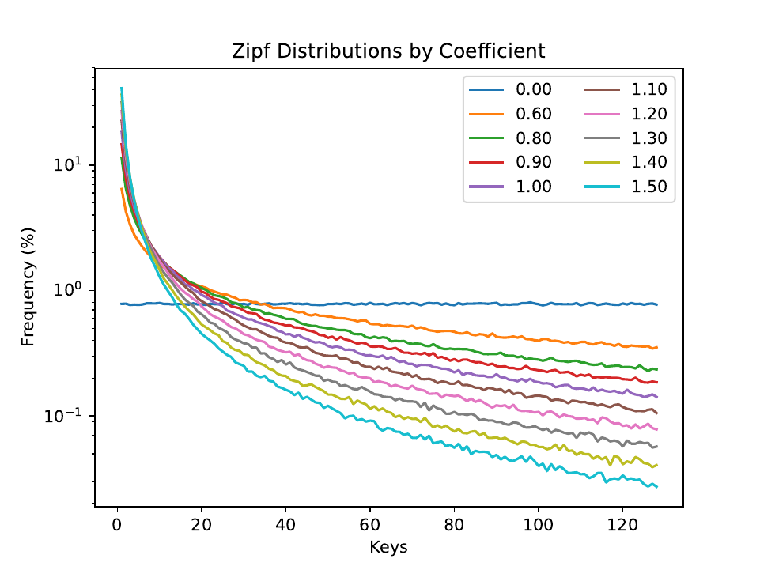
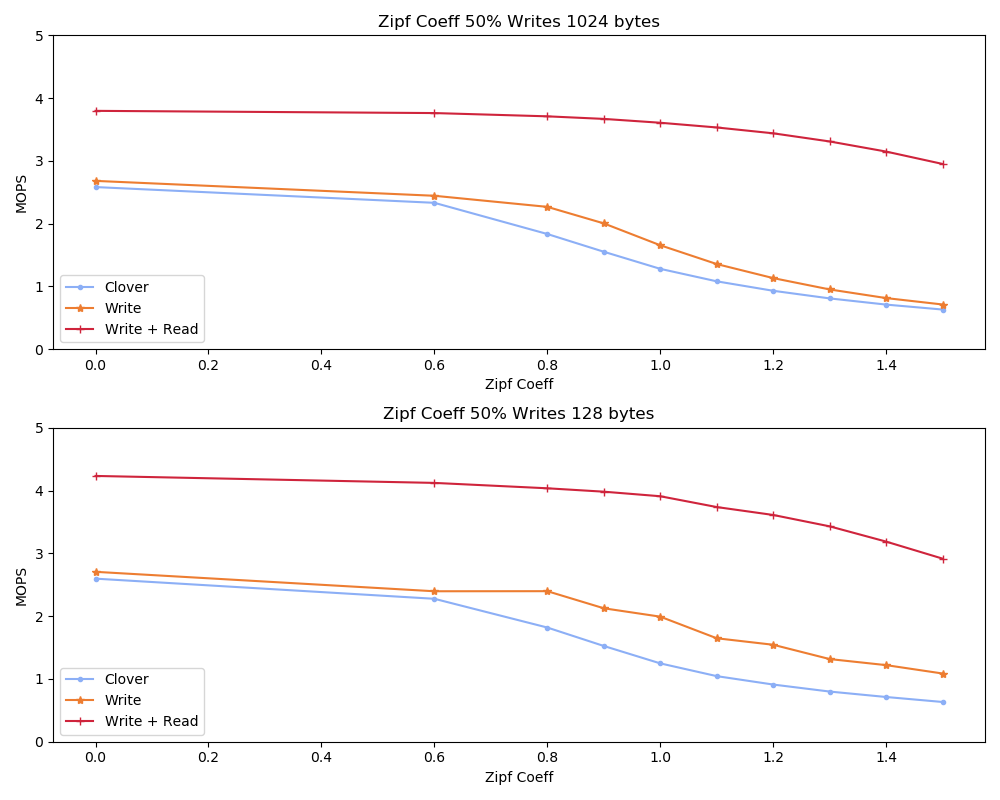

# Short Description May 23 2022

I never tested the zipf distribution on a bunch of different coefficients. I've decided that it's an important graph and I'm going to make it reguardless of what alex says. I don't think it's the main contribution or anything it's just clear to me that I should know whats going on.

I've set up the ycsb-gen script to generate workloads on a variety of zipf distributions. Note that in the past we were working at 0.75 which is not really even that zipf(y) considering how far we could go. Before running the experiments I plotted the distribution of the scripts so that I have a reference for later.

# Experiment 1 Plot the distribution of the keys

For reference here, a zipf of 0.0 is a uniform distribution. I'm not sure what 1 corresponds to, but it might be eulers number or something. The bottom line is that as the numbers get bigger, the skew towards smaller numbers increases dramatically.

# Experiment 2 Run with coeff on two packet sizes

The write + read steering is behaving rather well considering I've not really
done any tuning. For some strange reason the more tilted my zip is the write
+read still does worse. I'm not really sure why it's doing this. It would stand
to reason that perhaps I'm getting more misses on the read cache. I'm not sure
why that would happen though. I think that a fuller investigation of this is
required before we try to publish. In the ideal case it would be a straight line
right across the board.