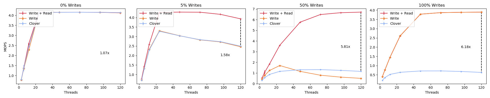
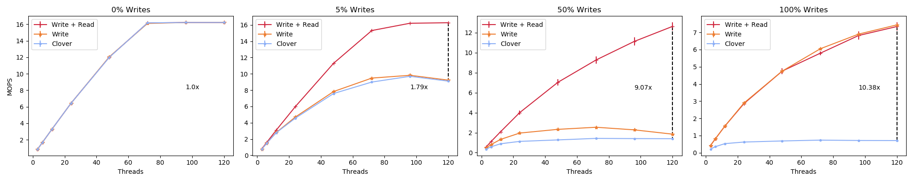

# Short Description May 24 2022

I'm in the process of adding a second host back into the mix. The results here are very similar to the experiments found in 027, they will all be hero plots, with the exception that there will be twice the number of hosts running. The goal of these experiments is to show that my results will scale to multiple machines.

